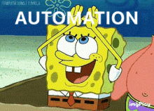

# ⬆️ Level up to Automation Testing with Katalon 🧪

This project serves as hands-on practice for what I've learned from the 
[**"Leveling up from a manual tester to an automation beginner (with Katalon Studio)"**](https://academy.katalon.com/learning-path/fresher-automation-engineer/) learning path.

<br>



<br>

### ✅ What's in this project:

<hr>

* Creating test cases using the **Katalon Record/Playback** feature.
* Capturing objects using the **Katalon Spy** feature.
* Adding **Data Files** for data binding in test cases.
* Creating more complex test cases using **Loops** and **Conditions**.
* Creating test cases by manually adding steps and drag/drop objects.
* Using the script interface to create test case scripts from scratch using predefined classes.
* Arranging objects into structured, functionality-related folders.
* Creating **Local** and **Global** Variables to use them dynamically in test cases.
* Abstracting test cases and calling them in other test cases when needed.
* Integrating with **Github** to handle version control actions.
* Creating **Test Suites**.
* Arranging **Test Suites** in **Test Suite Collections** to handle <u>***Concurrent***</u> and <u>***sequential***</u> tests on various browsers.
* Using **Katalon Studio Recording Engine Extension** to record test cases from active browsers.
* Creating and using **Custom Keywords** in test cases.

<br>


### ❌ What's <u>NOT</u> in this project (***due to Katalon free version limitations***):

<hr>

* Data Binding.
* Self Healing.
* StudioAssist.
* Debugging.
* Some Reporting features.

<br>

### 🧗 Challenges:

<hr>

* **Password Encryption:**

When passing **User Credentials** to the **Login Test Case**, The Test <u>*fails*</u> because it expects the **Password** to be **"encrypted"** and since the credentials were stored in **Global Variables** and **Data Files** without encryption, it was necessary to introduce a solution were the Password is being encrypted <u>*before*</u> setting the Input value.

***Solution:*** Create a **Custome Keyword** That can be used as a **Method Call** to set the Password Input Value.

```{groovy}
import com.kms.katalon.util.CryptoUtil

@Keyword
	def EncryptText (String PlainText) {
		return CryptoUtil.encodeSensitiveInfo(PlainText)
	}

```

<br>

### 🔗 Useful Links:

<hr>

* [**Katalon Studio Docs.**](https://docs.katalon.com/katalon-studio/about-katalon-studio)
* [**Activating browser-based video recording.**](https://docs.katalon.com/katalon-studio/test-reports/generate-test-reports/generate-browser-based-videos-in-katalon-studio-reports)
* [**Groovy Tutorials.**](https://www.tutorialspoint.com/groovy/index.htm)


