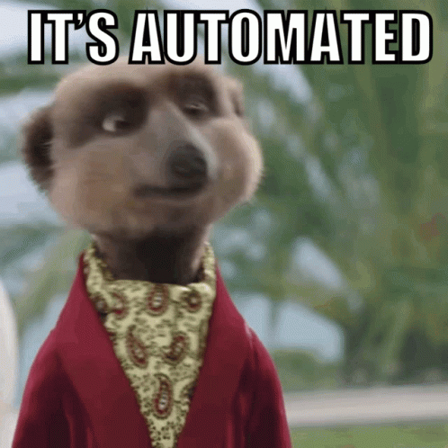

# ⬆️ Level up to Automation with Katalon:

This project serves as the applied hands-on practice for what I've learned from the [**Leveling up from a manual tester to an automation beginner (with Katalon Studio)**](https://academy.katalon.com/learning-path/fresher-automation-engineer/) learning path.

### ✅ What's in this project?

1. Creating test cases using the Katalon record/playback feature.
2. Capturing objects using the katalon spy feature.
3. Creating test cases by manually adding steps and drag/drop objects.
4. Using the script interface to create test case scripts from scratch using predefined classes.
5. Arranging objects into structured, functionality-related folders.
6. Creating variables in test cases.
7. Abstracting test cases and calling them in other test cases when needed.
8. Integerating with github to handle version control actions.
9. Creating test Suites.
10. Arranging test suites in collections to test handle concurrent and sequential tests on various browsers.
11. Using Katalon Studio Recording Engine Extension to record test cases from active browsers.

### ❌ What's <u>NOT</u> in this project?

1. Testing Data Binding and Data Driven tests due to the Katalon studio free version limitations.
